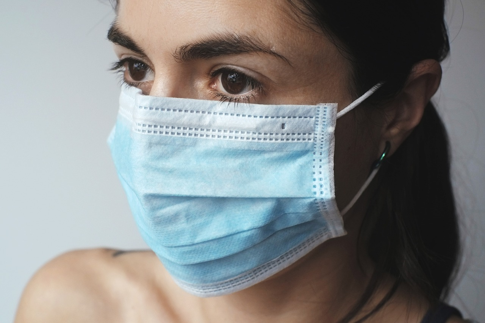

# Project: Face Mask Detection using Convolutional Neural Network (CNN)



## Introduction

The rapid advancement of Computer Vision technology has opened many new uses cases in recent years and this project aims to leverage these new technology and explore their application in the solving of  real world problems. The goal is to develop a Convolutional Neural Network (CNN) capable of accurately identifying whether an individual in an image is wearing a face mask or not. This technology has direct applications in public spaces, healthcare facilities, and various sectors where adherence to mask-wearing guidelines is crucial.

## Project Overview

**Objective**: The primary objective of this project is to build a robust Face Mask Detection model using Convolutional Neural Network techniques. The model aims to analyze images and determine whether the person in the image is wearing a face mask.

## Key Components

### Data Sourcing
<br>
 This project utilizes a prepared dataset sourced from Kaggle, consisting of images containing individuals with and without face masks. The dataset was chosen for its comprehensiveness, diversity, and the availability of labeled data. While traditional data collection involved capturing real-world scenarios, lighting conditions, and backgrounds, using a curated Kaggle dataset streamlines the process and ensures access to a high-quality, labeled dataset.

**Datasets**:
1. **Face Mask Detection Dataset**
     - **Description** This dataset is one that was collated specifically to train CNNs on mask detection. It features 7553 color images in two folders with_mask and without_mask. This makes it ideal for this project as the images are already labeled ready for model training.
     - **Usage**: This dataset is used to create the training data necessary for model training.
     - **Source Quality**: The data was sourced from Kaggle and is therefore a secondary source but features a high usability rating on the Kaggle website.
     - **Link**: [here](https://www.kaggle.com/datasets/omkargurav/face-mask-dataset)* 

### Data Analysis
<br>

<br>
*Figure 1. Bar Chart showing ratio of pictures classified as with and without masks*
<br>

<br>
*Figure 2. Sample image from dataset*
<br>

<br>
*Figure 3. Image Size Properties (width,height) for with mask images*
<br>

<br>
*Figure 4. Image Size Properties width,height) for without mask images*
<br>


### Data Preprocessing

#### Summary
The dataset underwent exploratory data analysis and visualization to ensure suitability. A dedicated function was developed to iterate through images and reshape them to conform to the models imput layer requirements. The function then created a list of arrays contained an image and label into the form of a binary value  (0 for without mask, 1 for with mask). The dataset was then split into training, validation, and test sets for effective model evaluation.

#### Steps
**Data Transformation Function**
- A Function was created which first creates an empty list.
- It then create a list of subfolders in folders.
- It then iterate through both folders and creates an integer using the folder index which will be used to define a binary classification corresponding to the current folder.
- The function then creates a list of all files in current folder and iterates through that list
- For each images, OpenCV is used to transform the image into a numpy array.
- OpenCV translates the images in BGR so the function then reverses the colors back to RGB.
- The image array is then resized to the correct shape for the input layer of the model
- The image array is then added a list with the image and the classification label and this list is added to the training data list.
<br>

```Python
def create_training_data(pixelWidth, pixelHeight,folder):
    training_data = []
    sub_folders = os.listdir(FOLDER)
    for folder in sub_folders:
        path = os.path.join(FOLDER, folder)
        classes = sub_folders.index(folder) #0,1 -> label for binary classification
        for img in os.listdir(path):
            try:
                # Read to array
                img_arr = cv2.imread(os.path.join(path,img))
                # BGR to RGB
                torgb = cv2.cvtColor(img_arr,cv2.COLOR_BGR2RGB)
                # Resize
                resize = cv2.resize(torgb,(pixelWidth,pixelHeight))
                # Place in array
                training_data.append([resize, classes])
            except Exception as e:
                pass 
    return training_data
```
**Shuffle Data**
- Data shuffling was performed to ensure random order of pictures.

**Create X and y**
- Labels and features were separated, and the data array are converted to a NumPy array.
<br>

```Python
X = np.array(x).reshape(-1,224,224,3)
Y = np.array(y)
```
<br>

**Save dataset**
- The final dataset was then saved using Pickle.
<br>

```Python
pickle_out = open("X.pickle", "wb")
pl.dump(X, pickle_out)
pickle_out.close()
pickle_out = open("Y.pickle", "wb")
pl.dump(Y, pickle_out)
pickle_out.close()
```
<br>

### Model Development
 The Keras library from Tensorflow was used for model developement by leveraging a pretrained model from that library and then using transfer learning to hone its parameters to the requirements of this task. This method saves on both training time and processing power required for model training. The model architecture was chosen to be as lightweight as possible to be capable of deployment to lower power devices with the aim of validating possible integrations to low resource devices such as CCTVs cameras. Training was conducted usings the prepared dataset over multiple epochs to achieve high accuracy in face mask detection.

### Model Evaluation
 The trained model will be evaluated on a separate test dataset to assess its performance in terms of precision, recall, and overall accuracy.

### User Interface or Deployment
 Depending on the project scope, a user-friendly interface may be developed to allow users to upload images for real-time face mask detection. Alternatively, the model can be deployed in applications for automated monitoring.

### Benefits

- **Public Health Safety**: The project directly contributes to public health safety by providing a tool to identify individuals not adhering to mask-wearing guidelines.

- **Automation in Monitoring**: The technology allows for automated monitoring in public spaces, reducing the need for manual intervention.

- **Versatile Applications**: Beyond pandemic scenarios, the model can find applications in various settings where mask detection is relevant, such as security and healthcare.

### Ethics and Regulations

- **Privacy Considerations**: The project emphasizes privacy by not collecting or storing personally identifiable information. The focus is solely on the presence or absence of face masks.

- **Algorithmic Fairness**: Efforts will be made to ensure that the model's predictions are fair and unbiased across different demographics.
